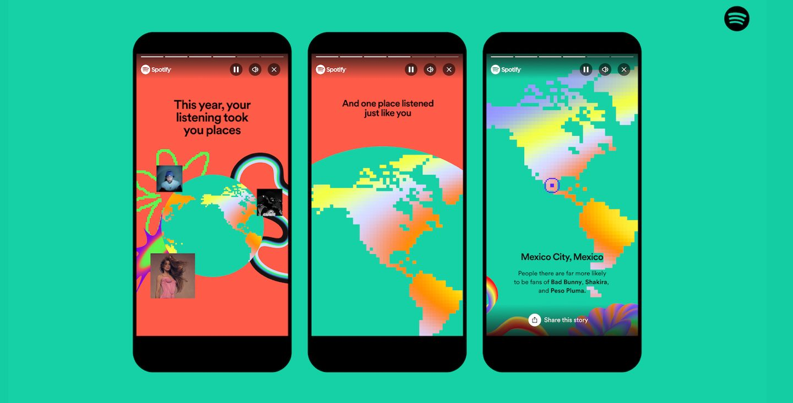

#  PEC 3. Visionando el futuro con las gafas de Manovich: redescubriendo la hibridación 

### Recurso de aprendizaje de Cultura Digital 

Autor: Jesús López Jareño

Fecha: Diciembre 2023
## Planteamiento

<figure>
    
    <figcaption>Freepik, n.d.</figcaption>
</figure>

En un mundo donde cada vez más tecnología inunda nuestra vida cotidiana, el concepto de hibridación aparece como un pilar fundamental en como comprender la evolución cultural y tecnológica. Lev Manovich en su libro “El software toma el mando” (Manovich, 2013) hace referencia a sobre cómo los medios digitales se tranforman y se integran con diversas formas de expresión en nuestra vida cotidiana. Este suceso lo define como hibridación, que simplemente quiere decir que no es una mezcla sino una fusión sinérgica que generan nuevas formas de medios y que redefinen nuestra interacción con el mundo digital. 

Manovich nos expresa la hibridación como una convergencia entre distintas tecnologías, cultura y arte. Llevando a crear un tejido interconectado donde lo nuevo tiene una base de lo antiguo. Esta analogía no solo implica una combinación de medios como el texto, audio o video, sino también la integración de nuevas funciones, roles y contextos que nos dan paso a que nazcan nuevas experiencias hibridas que son familiares y nuevas a la vez. Esta hibridación también nos hace que la interacción entre el usuario y la tecnología sea más profunda, lo que quiere decir, que no se quede simplemente en una tecnología que se consuma, sino que también se pueden personalizar, crear e interactuar. Estas características nos permiten que nazcan nuevas formas de creatividad y expresión.

Hay que destacar, que la hibridación transciende más allá de la fusión de tecnología y cultura. Es una nueva forma de cultura social, debido a que los nuevos medios no solo cambian lo que vemos y escuchamos, también cambia en como experimentamos y entendemos nuestro mundo. En este sentido, la hibridación es una evolución tecnológica como cultural que moldea a la sociedad en la que vivimos.  

En este ensayo, exploraremos como este concepto de hibridación se expresa en dos ejemplos contemporáneos: Hawkers con su probador virtual y Spotify. En estos ejemplos destacaremos la hibridación y como es su impacto en la era digital actual. 

## Re-descubriendo la hibridacion: Provador virtual de Hawkers

<figure>
    
    <figcaption>(GFHarris, n.d.)</figcaption>
</figure>

Hawkers es una marca de gafas de sol que ha revolucionado el marcado de la moda con su espectacular crecimiento, innovación y su buen marketing en el comercio electrónico. Hawkers ha ejemplificado el concepto de hibridación dentro del comercio electrónico con su probador virtual que incorpora realidad aumentada. Esta nueva tecnología permite a sus clientes que experimenten con diferentes estilos de gafas y pudiendo comprobar cómo le sientan las gafas antes de decidirse a comprarlas. Todo ello, mediante la conexión a internet utilizando un navegador web y dando permiso a la cámara del dispositivo desde el que se conecta.

Esta hibridación en Hawkers no se limita a la combinación de moda y tecnología, ya que ha redefinido la experiencia de compra que tienen sus clientes a la hora de comprar su producto. Este probador virtual ofrece una solución a un problema clave que tiene todo el comercio electrónico de la moda: la incapacidad de probar los productos antes de comprarlos. Al superar esta barrera, la marca no solo mejora la funcionalidad de su página web, también enriquece la experiencia con el cliente debido a que les ofrece una interacción más personal e inmersiva con sus productos. La tecnología de realidad aumentada que utiliza Hawkers se representa en la hibridación de los medios como una forma de combinar elementos visuales que están presentes en el mundo real con la información digitalizada y superpuesta, llevando a que esta tecnología se salte los limites tradiciones de la físico y lo digital. Dando como resultado al cliente una experiencia de compra que es tangible e intangible a la misma vez. 

Además, podemos observar que con esta hibridación va más allá de la funcionalidad, debido que toca aspectos emocionales en el proceso de compra, que permite a los clientes experimentar y jugar con su imagen de una manera que solo es posible en una tienda física. Mejorando la conexión emocional del cliente con la marca y producto haciéndole sentir en una tienda física, algo que para las marcas de moda es fundamentan debido a que verse bien con las prendas y accesorios de moda tiene un impacto emocional en las personas.  

En este mundo donde los límites entre lo que es virtual y real es cada vez más difuso, este tipo de herramientas muestran que se puede combinar lo mejor de ambos mundos para mejorar la comodidad y accesibilidad para los consumidores, abriendo también nuevas vías para la creatividad e innovación en el marketing y diseño de productos. En resumen, el probador virtual de Hawkers es un claro ejemplo de la hibridación en la era digital, conforme a las teorías de Manovich. Al integrar la realidad aumentada en la experiencia de compra. Hawkers ha creado una experiencia de usuario profundamente híbrida que redefine lo que significa "probarse" un producto en la era digital.

## Re-descubriendo la hibridacion: Spotify

<figure>
    
    <figcaption>(Spotify, n.d.)</figcaption>
</figure>

Spotify, es una plataforma de música en streaming que es líder mundial. Esta plataforma ha destacado por sus múltiples formas de clasificar la música por géneros o estados de ánimo, como también por las recomendaciones de música que ofrece de forma personalizada para el usuario. En este ejemplo de hibridación alineado con las teorías de Manovich, podemos observar cómo Spotify combina tecnología, datos y cultura para ofrecer una experiencia musical única para cada usuario y observado la evolución que han sufrido los formatos tradicionales de producción de música.

En la era de los vinilos, cassetes y CD la música tenía una experiencia limitada por el acceso a estos recursos físicos. Los oyentes dependían de tener las colecciones físicas para poder reproducir música y tener que transportarlos para escucharlos allá donde quisieran. Spotify ha transformado esta forma de reproducir música eliminando las barreras físicas y permitiendo que un usuario pueda acceder a una biblioteca de música ilimitada desde cualquier lugar del mundo desde su dispositivo móvil y en cualquier momento. Esta nueva hibridación de lo físico a lo digital ha democratizado la música, haciendo que sea más accesible a un público más amplio y sin restricciones físicas.  Además, ha cambiado la forma en la que interactuamos con la música. Con los sistemas físicos tendríamos que ir a comprar el álbum y después cargarlo en el dispositivo reproductor, ahora simplemente descargando la aplicación y con unos cuantos clics, podemos escuchar el último tema de nuestro artista favorito. 

Spotify no solo ha cambiado la forma en la que accedemos a la música, también a como somo capaces de descubrir música nueva.  En el pasado, el descubrimiento ocurría mediante las recomendaciones de amigos, la comprar de álbumes con buenas reseñas o escuchando una canción en la radio. Ahora con Spotify al recolectar datos sobre las canciones que escuchamos y nos gustan, nos ofrece una recomendación de nuevas canciones que nos pueden interesar, además de poder acceder a ella de forma clasificada por géneros o listas de recomendación de amigos. Al recoger nuestra información de la música que escuchamos, es capaz de recomendarnos artistas nuevos y promover a artistas emergentes y géneros en auge. Con esta capacidad de influir en las tendencias musicales, se muestra como la hibridación de esta aplicación es capaz de influir en la cultura musical que permite que las personas realmente escuchen la música que les gusta en cualquier momento. 

<figure>
    
    <figcaption>(Spotify, n.d.)</figcaption>
</figure>

Otra característica de hibridación que contiene Spotify es “Wrapped”. Al final de cada año, ofrece un resumen de forma personalizada de los artistas y canciones más escuchadas por el usuario, entre otros datos interesantes. La hibridación de esta funcionalidad se ha convertido en cultural ya que se comparten los resultados en redes sociales y llevan a debates o conversaciones sobre tendencias musicales en el año.

<figure>
    
    <figcaption>(Spotify, n.d.)</figcaption>
</figure>

En resumen, Spotify es una hibridación en el ámbito musical que ha marcado el paso de los formatos físicos a un acceso digital desde cualquier lugar. Esta transformación nos ha llevado más allá de la tecnología, ha sido una reconfiguración de la cultura y la experiencia de reproducir música que refleja el espíritu de hibridación descrito por Manovich, dende la música física ahora fluye en el espacio digital. 

## Conclusión
Los casos de Hawkers y su probador virtual y Spotify ilustran de manera efectiva el concepto de hibridación en la era digital, tal y como lo describe Lev Manovich. Hawkers representa la hibridación en el comercio electrónico al fusionar moda, realidad aumentada y experiencia de usuario, transformando radicalmente la experiencia de compra en línea. Por otro lado, Spotify ejemplifica la hibridación en el ámbito musical, combinando streaming, personalización basada en IA y elementos sociales, redefiniendo así la forma en que consumimos e interactuamos con la música. Viendo como la hibridación no se trata simplemente de la convergencia tecnológica, sino también de una transformación de la cultura y la experiencia de uso.  

En resumen, la hibridación de Manovich es un paradigma que redefine como interactuamos, experimentamos y entendemos el mundo en constante cambio a nuestro alrededor. 

### Referencias y Bibliografía

* Hawkers. (n.d.). Wikipedia. https://es.wikipedia.org/wiki/Hawkers
* Jose García. (2023, November 29). Spotify Wrapped 2023: cómo ver tu resumen del año con tus estadísticas de artistas y canciones favoritos. Xataka. https://www.xataka.com/basics/spotify-wrapped-2023-como-ver-tu-resumen-ano-tus-estadisticas-artistas-canciones-favoritos
* Manovich, Lev. (2013). El software toma el mando. El software toma el mando. Editorial UOC.
* MARTÍN BARBERO, I. (2023, November 16). Spotify potencia la búsqueda de contenido con inteligencia artificial de Google. Cinco Días. https://cincodias.elpais.com/cincodias/2023/11/16/lifestyle/1700135142_172210.html
* Pelegrin, A. (n.d.). ¿Cómo usa Spotify la inteligencia artificial? Larrosa. Retrieved December 10, 2023, from https://www.larrosa.pro/post/c%C3%B3mo-usa-spotify-la-inteligencia-artificial
* Spotify. (n.d.). Wikipedia. https://es.wikipedia.org/wiki/Spotify
* Freepik. (n.d.). Persona trabajando html en computadora. Spotify. https://www.freepik.es/foto-gratis/persona-trabajando-html-computadora_36190642.htm#page=2&query=tecnologia&position=6&from_view=search&track=sph&uuid=2a70dcbf-1668-4217-803a-36171ed865e6
* GFHarris. (n.d.). HAWKERS LOGO.jpg. Wikimedia. https://commons.wikimedia.org/wiki/File:HAWKERS_LOGO.jpg
* Spotify. (n.d.-a). How Spotify’s Playlists Captured the Biggest Music Trends of 2023. Spotify. https://newsroom.spotify.com/2023-11-29/music-editorial-playlists-genres-trends/
* Spotify. (n.d.-b). Spotify logo with text.svg . Wikipedia. https://es.m.wikipedia.org/wiki/Archivo:Spotify_logo_with_text.svg
* Spotify. (n.d.-c). Spotify Wrapped Sound Town: All You Need To Know. Spotify. https://newsroom.spotify.com/2023-12-01/wrapped-sound-town-berkeley-burlington-cambridge/
 

----

Licencia: Creative Commons desarrollado bajo licencia CC BY-SA 4.0. 
